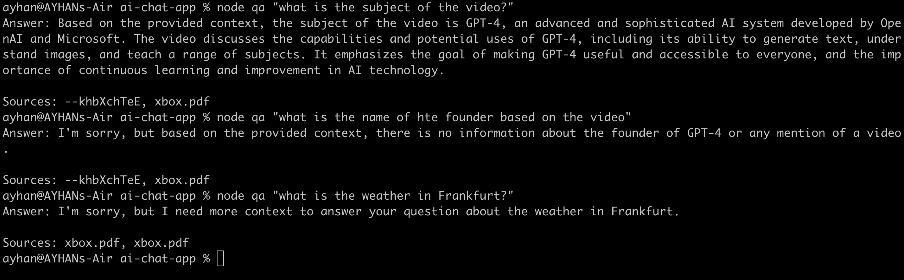

# AI Chat App

## Introduction

The AI Chat App is a Node.js application that integrates OpenAI's GPT-3.5 Turbo model. It offers an interactive platform for AI-based chat, search, and question-answer functionalities. This application is designed to showcase the integration of various AI tools and APIs in a single, cohesive project.

## Getting Started

### Prerequisites

Before beginning, make sure you have:

- An API key from OpenAI. Go to [OpenAI Platform](https://platform.openai.com/usage) to get your key. You'll receive a $5 credit, and token usage is generally very low.
- Node.js installed on your system, as it's essential for running the application.

### Environment Setup

Follow these steps to set up your development environment:

1. Install dotenv, which helps in managing environment variables and keeps your API key secure:

```bash
npm i dotenv
```

2. Istall the OpenAI package to enable chat functionalities within your app:

```bash
npm i openai
```

3. To enhance your app's search capabilities, install langchain:

```bash
npm i langchain
```

4. For the QA feature, you'll need additional libraries like pdf-parse and YouTube transcript APIs:

```bash
npm i pdf-parse youtube-transcript-api youtubei.js
```

## Sources for QA

Use xbox.pdf and OpenAI video transcripts as sources for the QA functionality.

## Main Logic

#The application's core functionalities include:

-Loading a combined memory vector store for data handling.
-Performing semantic similarity searches using the questions provided.
-Integrating with OpenAI's GPT-3.5 Turbo model to generate answers from the search results.
-Displaying AI-generated answers, alongside sources from YouTube videos or PDF documents.

## Usage

### Chat Bot

To use the chat bot:

1. Insert your questions in `index.js`.
2. Run the script `node index.js`

### Search Bot

To perform a search:

1. Add your search query inside `search.js`. For example:

```
console.log(await search('your query'))
```
Execute the script `node search.js`

## QA bot

To interact with the QA feature of the app, use the following command:

```bash
node qa "your question here"

```

Replace "your question here" with your actual query.



